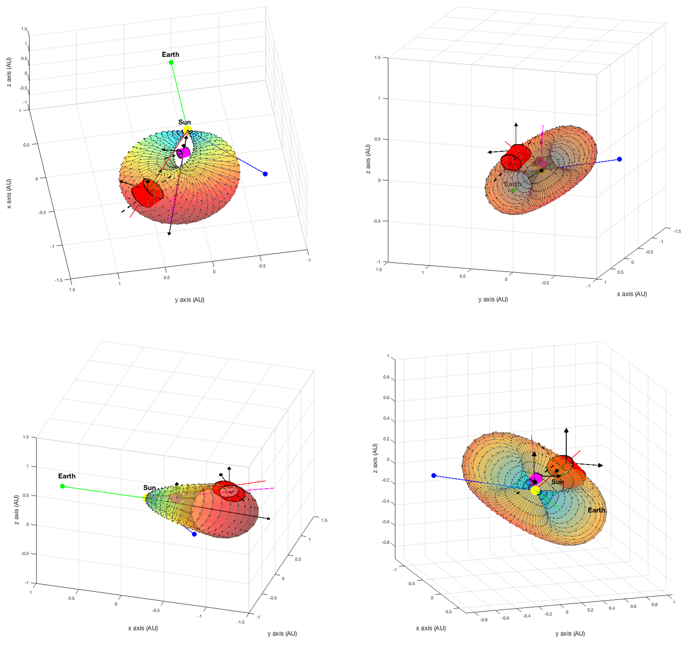
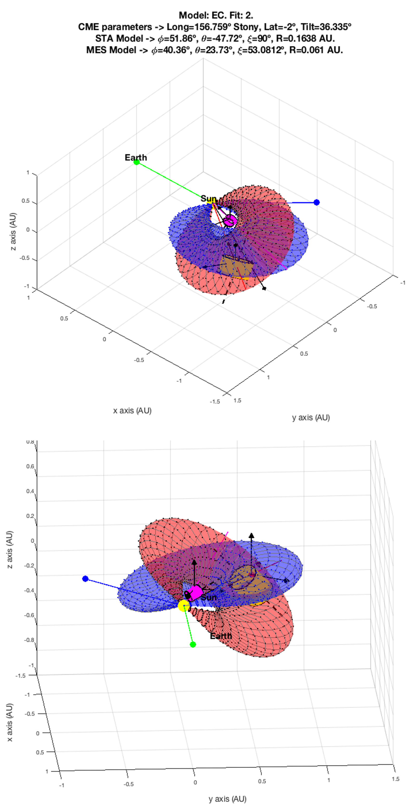

# icmes_plots_goddard
In this repository you will find some useful scripts to download and plot ICMEs' data from several NASA missions. The examples attached here have been specifically created for STEREO, although the same procedures shown here can be applied to different missions.

## In-situ plots

In order to plot the in-situ data of a desired time interval where a certain ICME may be occuring, we first need to download the corresponding in-situ data (magnetic field magnitude and components, density, velocity, temperature, etc.). This is done by using the [hapi server](https://github.com/hapi-server/data-specification/blob/master/hapi-2.1.0/HAPI-data-access-spec-2.1.0.md) created for this purpose. Thus, you should first follow the instructions on the previous link to install the `hapi client` in your python console to be able to proceed with the download process. Moreover, all the Python codes available enclosed in this repo have been developed in version 3.6, so keep that in mind if you are using later versions of Python, as some errors might then appear.

To generate the plots, we will be using the `main_STEREO.py` script, which uses the ICME start time, the MO start time and the ICME end time as inputs, located in an excel file with the following three columns:

ICME Start Time | MO Start Time | ICME End Time
------------ | ------------- | -------------
YYYY DOY M/D H/M | YYYY DOY M/D H/M | YYYY DOY M/D H/M

An example of the input structure for the plots is available in the enclosed files section, under the name `/data/2013par.xlsx`. In the first three rows of this particular example for STEREO A, year 2013, we have:

ICME Start Time | MO Start Time | ICME End Time
------------ | ------------- | -------------
2013 9 1/9 2:25 |	2013 9 1/9 10:38 | 2013 10 1/10 17:17
2013 25 1/25 0:14	| 2013 25 1/25 12:23 | 2013 27 1/27 3:00
2013 39 2/8 7:44 | 2013 39 2/8 18:22 | 2013 41 2/10 3:20

This information has been obtained from Lan Jian's list: http://www-ssc.igpp.ucla.edu/forms/stereo/stereo_level_3.html.

By selecting the year '2013' and spacecraft 'A' with the previous input example, we would then be obtaining an output like this:

### Available scripts

In this section, a brief description of what the function of each of the enclosed scripts is will be presented:

1.`read_hapi_st.py`: code in charge of acquiring the desired data through the _hapi server_ based on the information presented in the input excel file already explained. I highly recommend having a close look at the detailed instructions presented in [hapi server](https://github.com/hapi-server/data-specification/blob/master/hapi-2.1.0/HAPI-data-access-spec-2.1.0.md), to understand how the process of downloading the data actually works and be then able to apply it also to other missions, if desired.

2.`st_average.py`: the output of this script is used to correctly plot the three hodograms located at the end of each output image. It calculates an average of the measurements of the magnetic field and, as an input, we can choose the frequency based on which we want to perform the averaging: once, twice, three or four times per hour, etc.

3.`main_STEREO.py`: where the shape, structure and layout of the plots is defined. Also, at the beginning of this script is where we choose which spacecraft (A or B for the STEREO case) and year we will be working with.

## 3D remote sensing reconstruction plots

The MATLAB script `cylinders_auto_v3.m` offers us the possibility to generate a 3D representation of the ICME's shape of study in space. The output graph can be very useful if we want to predict whether the ICME of interest may be crossing a certain spacecraft or not, for example.

To use this program it is first necessary to perform the 3D ICME reconstruction by means of Thernisien's model with SolarSoft, as the output of this reconstruction will be the input for `cylinders_auto_v3.m`. Thereby, once we have finished the analysis with SolarSoft, each column of the point cloud shoud be exported as an independent `.csv` file that out script will then call.

This is an example of what type of images would be obtained by using this method:

Moreover, as you have also seen in the picture, the _Elliptic-cylindrical Analytical Flux Rope Model for Magnetic Clouds_ developed by Teresa Nieves-Chinchilla has also been added to the plot in order to compare the in-situ results acquired through in-situ measurements with the remote sensing reconstruction of the images taken by the satellites.

### Some extra comments
* As you will see, the code `cylinders_auto_v3.m` is not very clean and some variable names are not the best and can lead to confusion. Right now I do not have time to change this, but I will eventually (hopefully) fix this issue.
* The code `cylinders_auto_v3.m` has been designed for a very particular example, so it's not automated and you will have to be careful with the rotation matrices, always being careful with what coordinate system you are working with in order to rotate the structure the exact number of degrees.

## Citations
In case that you use any of the previous codes for your work, please cite the following document:

(Coming soon)
